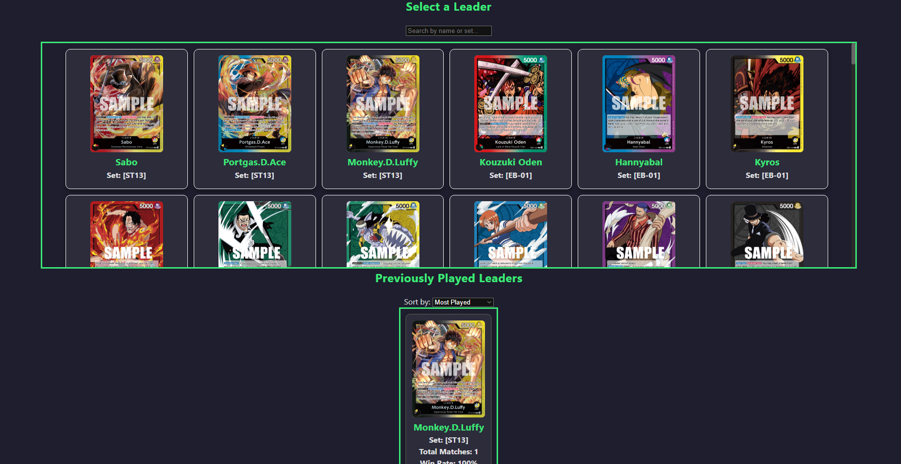
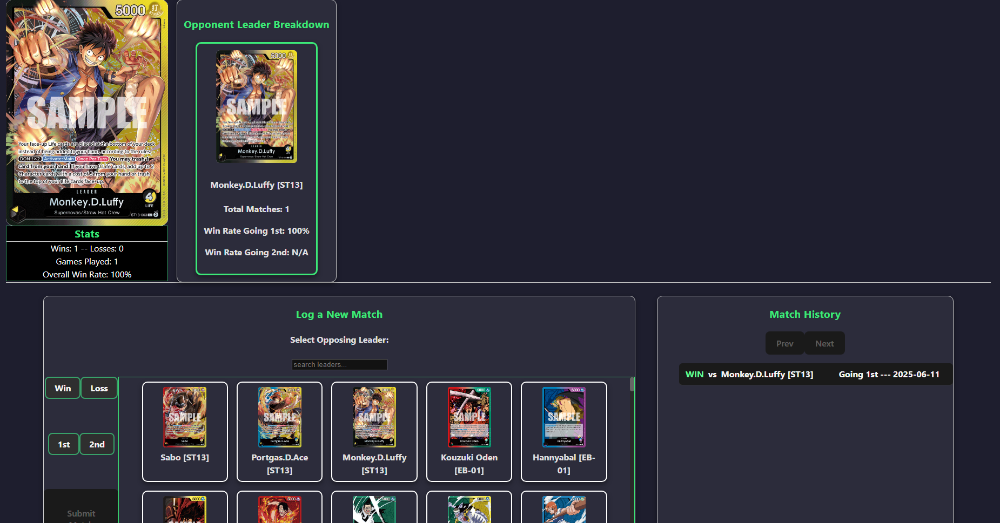

#  One Piece TCG Stat Tracker

A fullstack matchup tracker and analytics dashboard for the **One Piece Trading Card Game**. Built with a **React frontend**, **FastAPI backend**, and **PostgreSQL database**, this app allows players to log match results, analyze per-leader performance, and monitor win rates over time — all in one streamlined interface.

> 🛠️ Built entirely from scratch — including a custom backend and schema — due to the lack of any public, up-to-date One Piece TCG API.

---
## Live Demo
  https://optcg.shalestorm.net

## Screen Shots



---
##  Features

-  **Leader Management**
  - Select your current active leader from a full game-wide roster
  - Quickly swap leaders from the dashboard at any time

-  **Match Logging**
  - Log games with key data points: opponent leader, first/second turn, result
  - Match logs are persisted via a custom SQL-backed API

-  **Stat Tracking**
  - View your overall games played, win/loss record, and win rate
  - Breakdown by leader: performance vs every other leader faced
  - First vs second turn win rates
  - Rich per-leader analytics

-  **Leader History**
  - "Previously Played" section
  - Sort by most played or highest win rate
  - Visualize performance trends across multiple leaders

---

##  Tech Stack

| Tech         | Purpose                        |
|--------------|--------------------------------|
  **React**     Frontend SPA with routing and UI 
  **FastAPI**   Backend API (Python)           
  **PostgreSQL**  Relational database for match data 
  **SQLAlchemy**  ORM for data models and queries 
  **Docker**    Local development environment 
  **Vanilla CSS**  Styling (no UI frameworks)  

---

##  Getting Started

### Prerequisites

- Node.js & npm
- Python 3.11+
- PostgreSQL
- Docker (optional for local dev)

### Installation (Dev)

#### 1. Clone the repository

```bash
git clone https://github.com/shalestorm/one-piece-tcg-tracker.git
cd one-piece-tcg-tracker
